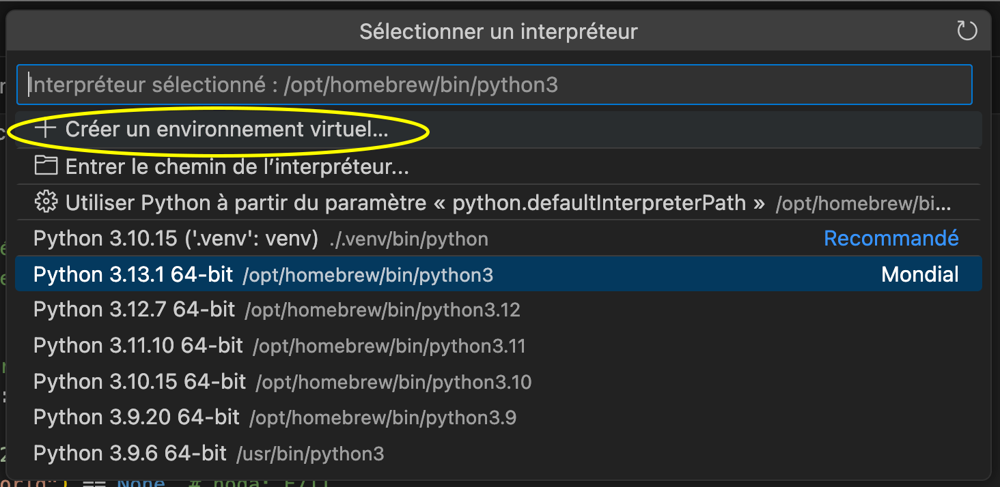
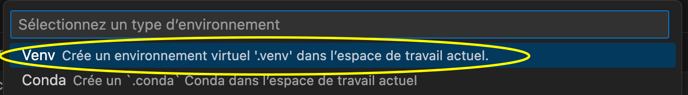
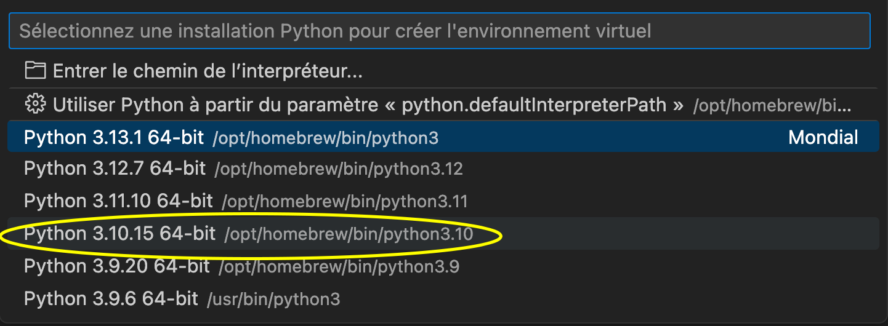
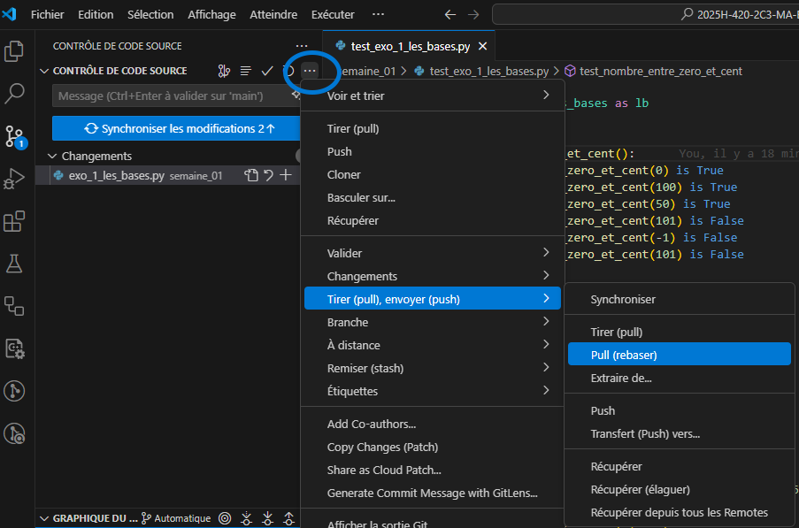

# Instructions pour les exercices formatifs

Les exercices formatifs seront pour la plupart des exercices de programmation en
Python. Ces exercices contiendront des tests unitaires qui permettront de
vérifier si votre code fonctionne correctement. Voici quelques conseils pour
bien travailler sur ces exercices.

## Utiliser un environnement virtuel

### Qu'est-ce qu'un environnement virtuel?
Python est un langage souvent utilisé et vous aurez donc à installer
plusieurs librairies pour travailler sur vos divers projets. Il fort probable
que ces projets utilisent des versions différentes de ces librairies voir même des
versions différentes de Python (ex: 3.10, 3.11, etc.). Pour éviter les conflits
entre ces différentes versions, il est possible de créer un environnement
virtuel. Un environnement virtuel est simplement un dossier qui contient une
version de Python et des librairies spécifiques à votre projet. Une fois
l'environnement virtuel activé, Python et votre environnement de développement
(VSCode ou PyCharm) utilisera les librairies et la version de Python contenues
dans cet environnement.

Ainsi, si chaque projet a son propre environnement virtuel, il n'y aura pas de
conflits entre les différentes versions de Python et les librairies.


### Comment créer un environnement virtuel?

Créer un dossier sur votre machine dans lequel vous mettrez tous vos fichiers
d'exercices pour ce cours. PyCharm ou VSCode propose parfois de créer un
environnement virtuel pour vous. Il suffit alors simplement de vous laisser
guider par ces outils.

Si ce n'est pas le cas, voici une façon simple de créer un environnement
virtuel sur VSCode.

1. Ouvrer un fichier python (.py) dans VSCode. 
2. Complètement en bas à droite de la fenêtre, vous devriez voir le nom de
   l'environnement Python que vous utilisez. Cliquez sur ce nom pour ouvrir un
   menu déroulant.
   
3. Cliquez sur "Créer un environnement virtuel".
   
4. Choisissez Venv comme environnement virtuel, c'est le plus simple.
   
5. Choisissez un nom pour votre environnement virtuel. Le nom standard est
   `.venv`.
6. Choisissez un interpréteur Python. Si la version 3.10 est disponible, je vous
   recommande de choisir cette version puisque c'est la version que nous
   utiliserons pour ce cours. Si la version 3.10 n'est pas disponible, ce qui
   est probable sur les ordinateurs du Collège, choisissez la version la plus
   récente.

   

### Comment activer un environnement virtuel?

Pour activer un environnement virtuel, il suffit d'ouvrir un terminal dans
VSCode et d'exécuter la commande suivante:

```
.venv\Scripts\activate
```

Si vous avez choisi un autre nom pour votre environnement virtuel, remplacez
`.venv` par le nom de votre environnement virtuel.

## Installer les librairies nécessaires
Pour pouvoir exécuter les tests unitaires, vous aurez besoin d'installer la
librairie `pytest`. Il se peut que d'autres librairies soient nécessaires pour
certains exercices. Pour installer l'ensemble des librairies nécessaires pour
les exercices, vous pouvez exécuter la commande suivante dans le terminal de
VSCode *après avoir activé l'environnement virtuel*.

```bash
python -m pip install -r requirements.txt
```

## Tirer (rebase) les changements de ce dépôt
Pour obtenir les derniers exercices, vous pouvez tirer les changements de ce
dépôt. Pour ce faire, vous pouvez exécuter la commande suivante dans le terminal
de VSCode.

```bash
git pull --rebase
```

Cette commande va non seulement tirer les changements du dépôt, mais elle va
aussi réappliquer vos changements locaux par dessus les changements tirés. Cela
permet de garder un historique propre et de résoudre les conflits plus
facilement. Ainsi, vos solutions seront toujours en haut de l'historique.

Vous pouvez aussi utiliser l'interface graphique de Git dans VSCode pour tirer
les changements.
| 

Bon travail ! :rocket: :100: